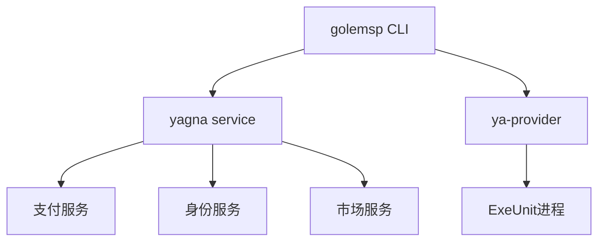

# Yagna 项目分析报告与变更说明

本文档旨在详细说明基于 `Piggy234/yagna` (dev 分支) 的修改内容，并对 Yagna 项目的整体架构和交互逻辑进行深入解析，帮助开发者快速理解系统运作机制。

## 1. 项目架构概览

Yagna 是 Golem Network 的官方 Rust 实现，作为一个去中心化的计算平台节点，它主要由以下核心组件构成：

### 1.1 核心组件

*   **Service Bus (GSB)**:  
    项目的神经中枢。所有内部组件（如 Market, Payment, Activity 等）都通过 GSB 进行通信。它解耦了各个服务，允许模块化开发和部署。
*   **Market Service**:  
    负责供需匹配。Requestor（请求者）和 Provider（提供者）在此通过协议（Agreement）达成合作意向。
*   **Payment Service**:  
    处理资金流转。支持多种支付驱动（如 ERC20, Dummy），管理发票（Invoice）、分配（Allocation）和实际的链上结算。
*   **Activity Service**:  
    管理计算任务的生命周期。负责创建执行环境（ExeUnit）、监控任务进度和销毁环境。
*   **Identity Service**:  
    管理节点身份（Node ID）和密钥对，确保通信和交易的签名验证。
*   **Net Service**:  
    处理节点间的 P2P 网络通信。

### 1.2 交互逻辑

1.  **启动流程**: `core/serv/src/main.rs` 作为入口，初始化并启动所有核心服务（Db, Identity, Market, Payment 等），并将它们注册到 GSB。
2.  **对外接口**: Yagna 暴露 REST API（默认端口 7465），供外部客户端（如 `golem-cli` 或 Python/JS SDK）调用。
3.  **前端集成**: 在本次修改中，Yagna 直接集成了一个 Web Dashboard，通过 `actix-web` 托管静态资源，并利用 REST API 与后端交互。

---

## 2. 本次修改详细说明

本次更新主要集中在**前端可视化集成**、**智能合约集成**以及**Staking 逻辑支持**，旨在提升用户体验并支持更复杂的链上交互。

### 2.1 智能合约集成 (Smart Contracts) - PR #2
*变更提交 ID: `c01c6ec` (Merge)*

此部分主要引入了全新的智能合约项目结构，用于支持质押等业务逻辑。

*   **`yagna-staking/` (新目录)**:
    *   这是一个完整的 Hardhat 工程，包含合约源码、部署脚本和测试配置。
    *   **`contracts/StakingManager.sol`**: 核心合约文件，实现了质押管理逻辑（如质押、解质押、奖励计算等）。
    *   **`scripts/deploy.ts`**: TypeScript 编写的部署脚本，用于将 `StakingManager` 合约部署到目标网络（如 Holesky 测试网）。
    *   **`hardhat.config.ts`**: Hardhat 配置文件，定义了网络连接、编译器版本等。
    *   **其他**: 包含 `package.json`（依赖管理）、`tsconfig.json`（TS 配置）等标准项目文件。

### 2.2 后端逻辑变更 (Backend & Staking) - PR #1
*变更提交 ID: `b31ff84` (Merge)*

此部分修改了 Yagna 的 Rust 后端代码，以适配新的前端和合约交互需求。

*   **`Cargo.toml` & `Cargo.lock`**:
    *   更新了项目依赖，特别是引入了 `dashboard` feature 相关的库（`rust-embed`, `mime_guess`）。
*   **`core/serv/src/main.rs` & `lib.rs`**:
    *   **Dashboard 集成**: 新增了 `dashboard` 模块定义和 HTTP 路由（`/dashboard`），用于托管前端静态资源。
    *   **服务启动**: 调整了服务启动流程，确保在启动核心服务的同时，Web 服务器也能正确加载嵌入的前端文件。
    *   **Staking 逻辑**: 虽然主要体现为架构调整，但为后续的质押状态查询和交互预留了接口和逻辑分支。

### 2.3 前端仪表盘集成 (Dashboard)
*(包含在上述 PR 中)*

*   **`yagna-dashboard/` (新目录)**:
    *   包含了完整的 React 前端项目源码。这是仪表盘的源文件，构建后会被嵌入后端。

### 2.4 功能实现与影响

1.  **全栈合约支持**: 引入 `yagna-staking` 目录标志着项目现在拥有了独立的链上业务层，不再仅依赖外部合约。
2.  **可视化管理**: 用户无需再依赖复杂的命令行指令。通过浏览器访问本地端口（如 `http://127.0.0.1:7465/dashboard`），即可直观地查看钱包余额、交易记录、协议状态等。
3.  **Staking 闭环**: 从合约 (`StakingManager.sol`) 到后端逻辑，再到前端展示，形成了一个完整的质押功能闭环雏形。
4.  **部署简化**: 将前端打包进后端二进制文件，极大地简化了部署流程。用户只需运行一个 `yagna` 可执行文件，即可同时获得后台服务和管理界面。

## 3. 交互逻辑演进对比

### 3.1 原始交互逻辑 (Legacy Flow)

在引入 Dashboard 和智能合约之前，Yagna 的交互主要围绕 **Market (市场)** 和 **Payment (支付)** 两个核心服务展开，且完全依赖 CLI 或 SDK。

1.  **启动节点**: 用户通过命令行运行 `yagna service run`。
2.  **市场匹配**:
    *   **Provider**: 发布 Offer，描述自己的计算资源。
    *   **Requestor**: 发布 Demand，描述所需的计算资源。
    *   **Match**: Market Service 匹配供需，双方通过 P2P 协商达成 **Agreement (协议)**。
3.  **任务执行**: Requestor 将任务代码（如 Docker 容器、WASM）发送给 Provider 执行。
4.  **支付结算**:
    *   任务完成后，Provider 发送 Invoice (发票)。
    *   Requestor 确认后，通过 Payment Service 发起链上转账（GLM 代币）。
    *   **缺点**: 整个过程缺乏直观的资金管理界面，且没有“质押”概念，恶意节点成本较低。

### 3.2 修改后的交互逻辑 (New Staking Flow)

新的架构引入了 **Dashboard (可视化)** 和 **StakingManager (合约)**，极大地丰富了交互维度，特别是引入了“房东” (Landlord) 角色和奖惩机制。

#### A. 角色定义
*   **Landlord (房东)**: 即原来的 Provider，现在需要质押才能接单。
*   **Admin (管理员/调度器)**: 拥有合约管理权限，负责执行惩罚 (Slash) 和发放奖励。

#### B. 核心交互流程

1.  **质押 (Deposit)**:
    *   **操作**: 用户（房东）在 Dashboard 上点击“质押”按钮。
    *   **底层**: 调用 `StakingManager.deposit()`，发送 ETH/MATIC 到合约。
    *   **状态**: 链上状态 `isRegistered` 变为 `true`，Yagna 后端同步此状态，允许节点参与市场匹配。

2.  **市场匹配与验证**:
    *   **操作**: 自动进行。
    *   **变化**: Market Service 在匹配时会校验 Provider 是否已质押。未质押的节点即使发布 Offer 也不会被 Requestor 选中（或被过滤）。

3.  **奖惩机制 (Incentive & Slashing)**:
    *   **惩罚 (Slash)**:
        *   若 Yagna 后端（或监控服务）检测到节点在任务中途恶意掉线或计算错误。
        *   **调用**: Admin 调用 `StakingManager.slash(landlord_address, percentage)`。
        *   **后果**: 扣除部分质押金，增加 `slashCount`（阶梯惩罚比例），资金转入 Admin 账户。
    *   **奖励 (Reward)**:
        *   任务顺利完成。
        *   **调用**: Admin 调用 `StakingManager.addReward(landlord_address)` 并附带 ETH/MATIC。
        *   **后果**: 奖励累积在合约的 `rewards` 字段中，而非直接打入钱包。

4.  **提取资金 (Withdraw)**:
    *   **操作**: 用户在 Dashboard 点击“提取”。
    *   **底层**: 调用 `StakingManager.withdraw()`。
    *   **后果**: 取回所有本金 + 奖励，同时 `isRegistered` 变为 `false`，节点自动下线。

### 3.3 总结对比

| 特性 | 原始逻辑 | 修改后逻辑 |
| :--- | :--- | :--- |
| **入口** | 命令行 (CLI) | Web Dashboard + CLI |
| **准入门槛** | 无（任意节点可接入） | **有（需质押 ETH/MATIC）** |
| **资金流向** | P2P 直接转账 (Requestor -> Provider) | **合约托管 (Staking Pool)** + 奖惩分发 |
| **信任机制** | 依赖声誉系统 (Reputation) | **依赖经济抵押 (Staking/Slashing)** |
| **支付触发** | Requestor 主动发起 | **Admin (调度器) 统一结算奖励** |

## 4. CLI 命令详解与完整交互流程

为了帮助用户理解如何操作 Yagna 节点（无论是原始版本还是修改版），本节列出了核心 CLI 命令及其在完整交互流程中的位置。

### 4.1 核心 CLI 命令速查

Yagna 生态主要包含两个核心命令行工具：

1.  **`yagna` (Core Daemon)**: 负责底层服务、网络、支付和身份管理。
    *   `yagna service run`: 启动核心守护进程（修改版同时启动 Dashboard）。
    *   `yagna payment init`: 初始化支付账户（生成钱包地址）。
    *   `yagna payment status`: 查看账户余额和状态。
    *   `yagna id create/list`: 管理节点身份 (Node ID)。
    *   `yagna app-key create <name>`: 生成 API Key（Requestor 连接节点必须）。

2.  **`ya-provider` (Provider Agent)**: 负责作为“算力提供者”参与市场。
    *   `ya-provider run`: 启动 Provider 代理，开始接单。
    *   `ya-provider preset create`: 创建报价预设（定义价格、硬件资源）。
    *   `ya-provider preset list`: 查看当前报价配置。

### 4.2 完整交互流程演练

#### 场景 A：作为算力请求者 (Requestor)
*(适用于开发者发布任务)*

1.  **启动节点**:
    ```bash
    yagna service run
    ```
2.  **初始化支付 (首次运行)**:
    ```bash
    yagna payment init --sender
    ```
    *   *注：此时需向生成的地址充值 GLM 和 ETH/MATIC (作为 Gas)。*
3.  **获取 API Key**:
    ```bash
    yagna app-key create my-requestor
    # 输出: 32字节的 Key，用于 SDK 连接
    ```
4.  **运行任务脚本**:
    使用 Python/JS SDK 编写脚本，配置上述 Key，运行脚本即可自动匹配 Provider 并计算。

#### 场景 B：作为算力提供者 (Provider/Landlord)
*(适用于矿工/房东分享算力)*

**1. 基础配置 (CLI)**
```bash
# 1. 启动守护进程
yagna service run

# 2. 初始化支付 (接收端)
yagna payment init --receiver

# 3. 创建报价预设 (设置价格)
ya-provider preset create --name default --price 0.1
```

**2. 质押激活 (Dashboard - 新增步骤)**
*   打开浏览器访问 `http://127.0.0.1:7465/dashboard`。
*   进入 **"Staking"** 页面。
*   点击 **"Deposit"**，确认支付质押金 (ETH/MATIC)。
*   等待链上确认，状态变为 "Registered"。

**3. 启动接单 (CLI)**
```bash
ya-provider run
```
*   此时 Market Service 会自动校验步骤 2 中的质押状态。
*   如果质押有效，节点开始在网络中广播 Offer，等待匹配。

**4. 结算与提取 (Dashboard - 新增步骤)**
*   当不再提供算力时，停止 `ya-provider`。
*   在 Dashboard 点击 **"Withdraw"** 取回本金和奖励。

## 5. 总结

本次修改将 Yagna 从一个纯粹的后台守护进程（Daemon），进化为一个用户友好的全栈应用。它保留了原有的模块化架构，利用 Rust 的强大性能处理核心业务，同时通过集成 React 前端弥补了交互体验上的短板。对于开发者而言，理解 `core/serv/src/main.rs` 中的服务注册流程和路由配置，是掌握项目运行机制的关键。


# Yagna 配套 CLI 工具

Yagna 项目提供多个 CLI 工具，其中 `golemsp` 是主要的用户友好接口<cite repo="golemfactory/yagna" path="golem_cli/README.md" line="1" end="4" />。

## 主要 CLI 工具

### 1. golemsp - 用户友好提供者 CLI

`golemsp` 是运行提供者节点的简化 CLI 工具，它作为高级编排器管理多个底层进程<cite repo="golemfactory/yagna" path="golem_cli/src/main.rs" line="95" end="104" />。

**核心命令**：
- `golemsp run` - 启动提供者节点（运行 yagna service + ya-provider）<cite repo="golemfactory/yagna" path="golem_cli/src/main.rs" line="97" end="97" />
- `golemsp stop` - 停止提供者节点<cite repo="golemfactory/yagna" path="golem_cli/src/main.rs" line="98" end="98" />
- `golemsp status` - 显示节点状态<cite repo="golemfactory/yagna" path="golem_cli/src/main.rs" line="103" end="103" />
- `golemsp setup` - 初始配置向导<cite repo="golemfactory/yagna" path="golem_cli/src/main.rs" line="96" end="96" />
- `golemsp settings` - 配置节点设置<cite repo="golemfactory/yagna" path="golem_cli/src/main.rs" line="99" end="102" />

### 2. yagna - 核心服务 CLI

`yagna` 是核心服务的 CLI 工具，提供底层功能访问<cite repo="golemfactory/yagna" path="golem_cli/src/command/yagna.rs" line="237" end="258" />。

**主要功能**：
- `yagna service run` - 运行 Yagna 守护进程
- `yagna payment` - 支付管理（初始化、状态、转账等）<cite repo="golemfactory/yagna" path="core/payment/src/cli.rs" line="46" end="148" />
- `yagna id` - 身份管理（创建、列表、应用密钥）<cite repo="golemfactory/yagna" path="core/identity/src/cli.rs" line="10" end="17" />
- `yagna version` - 版本管理<cite repo="golemfactory/yagna" path="core/version/src/service/cli.rs" line="24" end="32" />

### 3. ya-provider - 提供者代理 CLI

`ya-provider` 是提供者代理的专用 CLI 工具<cite repo="golemfactory/yagna" path="golem_cli/src/command/provider.rs" line="34" end="47" />。

**核心命令**：
- `ya-provider config get/set` - 配置管理<cite repo="golemfactory/yagna" path="golem_cli/src/command/provider.rs" line="49" end="85" />
- `ya-provider preset list/create/update` - 预设管理<cite repo="golemfactory/yagna" path="golem_cli/src/command/provider.rs" line="87" end="100" />
- `ya-provider exe-unit list` - 运行时列表<cite repo="golemfactory/yagna" path="golem_cli/src/command/provider.rs" line="102" end="122" />
- `ya-provider run` - 运行提供者代理

## 架构关系



`golemsp` 作为高级接口，自动管理 `yagna service` 和 `ya-provider` 进程的生命周期<cite repo="golemfactory/yagna" path="golem_cli/README.md" line="7" end="8" />。

## 安装和使用

**快速安装**：
```bash
curl -sSf https://join.golem.network/as-provider | bash -
```
<cite repo="golemfactory/yagna" path="docs/provider/overview.md" line="7" end="7" />

**基本使用流程**：
1. `golemsp setup` - 初始配置
2. `golemsp run` - 启动节点
3. `golemsp status` - 查看状态
4. `golemsp stop` - 停止节点

## Notes

这些 CLI 工具形成了分层架构：`golemsp` 提供简化用户体验，`yagna` 和 `ya-provider` 提供底层功能。开发者可以直接使用底层 CLI 进行高级配置，而普通用户推荐使用 `golemsp`。

Wiki pages you might want to explore:
- [Development and Operations (golemfactory/yagna)](/wiki/golemfactory/yagna#8)
- [Provider System (golemfactory/yagna)](/wiki/golemfactory/yagna#3)

Wiki pages you might want to explore:
- [Architecture Overview (golemfactory/yagna)](/wiki/golemfactory/yagna#1.1)
- [Development and Operations (golemfactory/yagna)](/wiki/golemfactory/yagna#8)